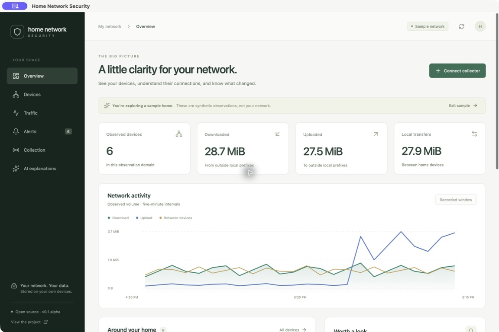

# Home Network Security

Understand the devices on your home network, their internet traffic, and their conversations with each other.

An open-source desktop application for **macOS and Windows**, with a Rust collector that can run on a local computer, Linux VM, or Raspberry Pi. Observations stay on your devices. Discovery, traffic analysis, and evidence-backed alerts do not require AI.

> **v0.1 alpha.** This is an observation tool, not a replacement for a firewall or a proven intrusion-detection system. Collection coverage depends on your hardware and sensor placement. The desktop app supports real ChatGPT/Grok subscription sign-in through their official clients and local discovery/capture controls. AI explanations stream inside the app after explicit summary review, using the selected model and reasoning effort.



## What you can do

- Explore a clearly labeled synthetic home network without scanning anything.
- Discover hosts and optionally check common TCP services with Nmap, or import Nmap XML. Missing tools have guided setup.
- Import PCAP/PCAPNG through separately installed TShark, or normalized NDJSON.
- Capture IP traffic from an explicitly chosen interface with a bounded recording duration.
- Inspect internet uploads, downloads, local transfers, device details, and supporting conversations.
- Rename observed devices and mark alerts reviewed in local SQLite storage.
- Connect the desktop app to a collector over loopback or a user-managed SSH tunnel.
- Review a detailed device summary and send it to ChatGPT or Grok, with model/effort controls and streamed responses.

Open **Collection → Scan from this computer** to detect tools and interfaces, choose a local private subnet, and run device discovery. Choose an interface and duration for packet-metadata capture; the desktop dashboard reads the resulting local observations. Capture permissions and drivers are checked by the actual capture attempt. Discovery and capture do not start when the app launches.

Open **AI explanations** to sign in, check the session, or sign out. Complete the official device-code consent in your browser. Existing sessions restore automatically. See [provider setup](docs/providers.md) for tested client versions, model selection, usage checks, and reviewed sends.

The app never starts a capture or discovery scan automatically. It does not block devices, change router rules, automatically send network data to AI, request API keys, or fall back to paid API inference.

## Try it

Prerequisites: Node.js 22.22.2+ (or 24.15+) and current stable Rust. The desktop build also needs [Tauri's platform prerequisites](https://v2.tauri.app/start/prerequisites/): Xcode command-line tools on macOS; Visual Studio C++ build tools and WebView2 on Windows. Run commands from the repository root.

```sh
npm ci
npm run desktop
```

The native app starts with an empty local database. Choose **Collection → Explore sample** for the demo, or import your own authorized observations. Browser-only preview:

```sh
npm run dev
```

The browser preview is synthetic data only; capture, file access, and collector connections require the desktop app. The browser demo's edits reset when the page reloads. Native sample edits last until the app exits.

Build native bundles on the target platform:

```sh
# macOS
npm run tauri -- build --bundles app,dmg
# Windows
npm run tauri -- build --bundles nsis
```

CI produces **unsigned development artifacts**, not signed/notarized releases. Check the [Actions runs](https://github.com/CyberJorsh/home-network-security/actions) for each platform's actual result. A successful Windows build alone does not establish capture-driver or GUI operation on a Windows device.

## Collect observations

```sh
cargo build --release -p hns-collector
# Windows executable ends in .exe.
./target/release/hns-collector doctor
./target/release/hns-collector snapshot --demo
./target/release/hns-collector --sensor office import observations.ndjson
./target/release/hns-collector --sensor office import authorized-capture.pcapng
./target/release/hns-collector --sensor office snapshot
```

For live collection, install TShark/Wireshark command-line tools separately and configure capture permissions. Install Nmap separately if you need active discovery. On Windows, packet capture also requires an appropriately licensed capture driver. These external tools are **not bundled**.

```sh
# Enumerate interfaces without starting capture:
tshark -D
# These two commands actively observe/probe the selected network. Use only with permission.
./target/release/hns-collector --sensor office capture --interface YOUR_INTERFACE --seconds 60
./target/release/hns-collector --sensor office discover 192.168.1.0/24
# Serving the UI API does not start capture; run alongside capture in another terminal.
./target/release/hns-collector serve --port 9898
```

Read the [collector guide](docs/collector.md) before choosing a sensor location. A Raspberry Pi plugged into an ordinary switch port cannot see everyone's unicast traffic. A router uplink may see internet traffic while missing local transfers. Mirror ports, taps, AP/router exports, or virtual-switch mirroring may be needed. Coverage starts **unverified** and is never inferred from a successful connection.

## Privacy and limits

- Local SQLite database; raw packet payloads are not saved by this app. Imported capture files remain where you placed them.
- Up to 100,000 normalized observations retained globally, with a configurable record limit. Hour/day/week/all views summarize all retained records in that range for one sensor. MAC-linked names and first-seen history persist separately; upload alerts use UTC hourly windows. Totals are retained evidence, not lifetime traffic.
- No cross-sensor totals that could double-count mirrored packets. No long-term aggregation or configurable time range yet.
- Device identities are observed IP/MAC combinations within a sensor domain. DHCP changes, randomized MACs, IPv6 privacy addresses, or missing link-layer metadata may create separate entries. Names do not authenticate devices.
- Prefix configuration determines internet versus local traffic. Add your globally routed home IPv6 prefix when applicable.
- Capture loss is currently **unknown**; quiet traffic does not prove a healthy or complete sensor.
- Encrypted contents, destination reputation, device ownership, and compromise cannot be inferred just from these records.
- Application data is not encrypted by the app. Use your OS account protections and disk encryption; see [security policy](SECURITY.md).

## Contribute

```sh
npm run check
npm test
npm run build
npm run format:check
cargo fmt --all --check
cargo clippy --workspace --all-targets -- -D warnings
cargo test --workspace
python3 scripts/smoke_collector.py
# Requires TShark, only reads a generated synthetic PCAP:
python3 scripts/smoke_pcap.py
```

Start with [CONTRIBUTING.md](CONTRIBUTING.md), [architecture](docs/architecture.md), [verification](docs/verification.md), and the [roadmap](docs/roadmap.md). AI is optional; the required provider direction is ChatGPT and Grok subscriptions, not API billing. [Provider integration notes](docs/providers.md) explain containment, allowance checks, and remaining platform gates.

## License

Project code is licensed under [Apache-2.0](LICENSE). External dependencies retain their own licenses. Wireshark, Nmap, Npcap, and provider clients are separately installed; see [third-party notes](THIRD_PARTY.md). No third-party product affiliation or endorsement is implied.

See [installation and signing acceptance](docs/installation-acceptance.md) for release verification and physical-device gates.
